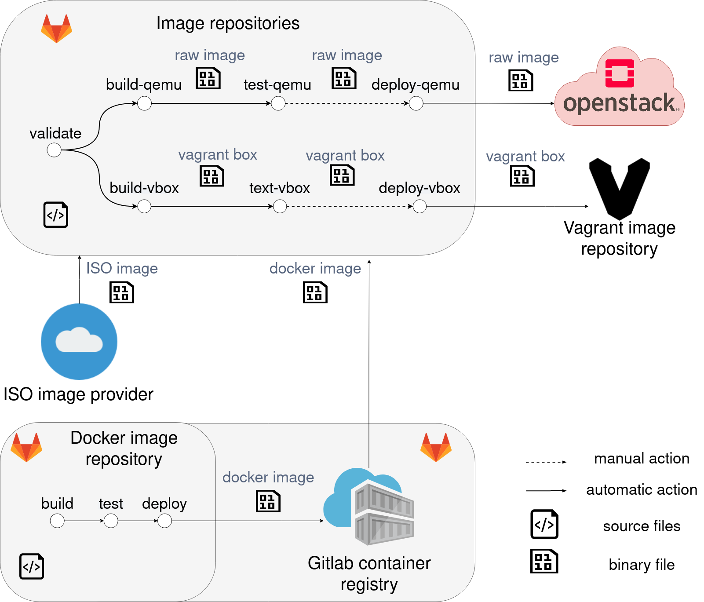

# CI-CD-virtual-images

This repository contains definitions of pipelines for creating virtual images, which are shown in the top of the Figure. The pipeline in the bottom of the Figure is in [docker-image-builder](https://gitlab.ics.muni.cz/muni-kypo-images/docker-image-builder). For more information see this [thesis](https://is.muni.cz/th/pkevc/).

## License

This project is licensed under the [MIT License](LICENSE).
